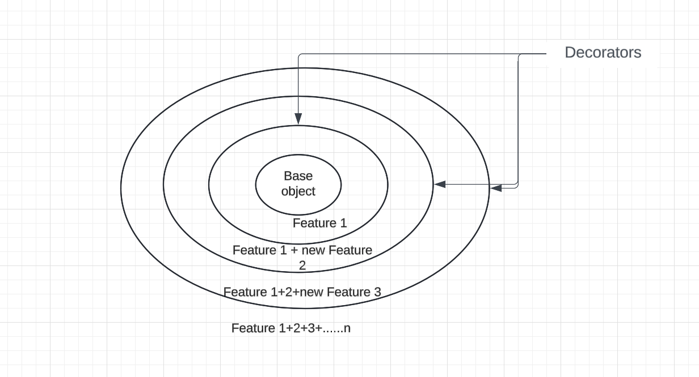
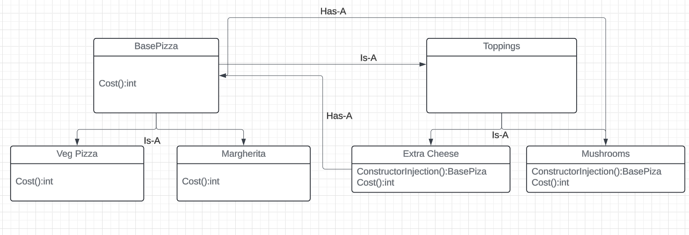

In decorator pattern we have a base object having feature F1 and when we want to add additional feature say F2 to this base object we wrap it in a decorator. Refer below diagram for clarity:

Why do we need Decorators?
To avoid class explosions.

What is class explosion?
Consider a simple veg pizza which is base class. No if you want to add multiple toppings(adding new features) on it the you'll have to create multiple classes inheriting the veg pizza and adding a topping on it. 
There will be multiple types of pizza's and each pizza can have different toppings this lead up to creation of exponential number of classes.

To avoid this we need decorators. we will just wrap the base class object with additional features.

