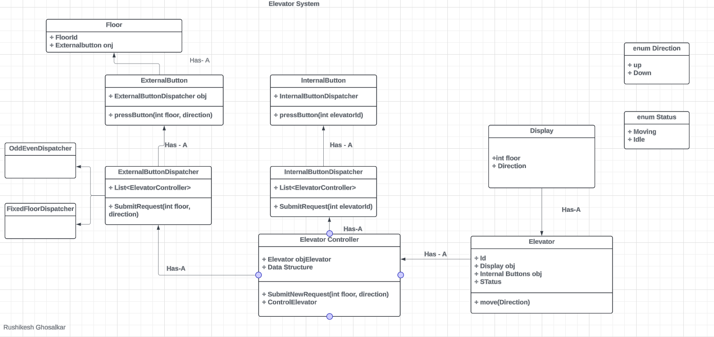

Requirement:
1. For many elevators the system need to be designed => n lifts
2. On what basis elevators will be called.
    a. Odd Even Basis
    b. Fixed floors for an elevator basis
    c. Nearest lift

Objects:
1. Floor
2. Building
3. Elevator:
    a. Internal buttons
    b. Display
    c. External Buttons
    d. Status (Enum: {moving, idle})
    e. Direction (Enum: {up, down})
4. Internal Buttons
5. External Buttons
6. Display

UML:
* We need a data structure to store requests(requests will have floor and which direct to move in)
* Elevator is a dumb object it is controller by ElevatorController.
* SubmitNewRequest(int floor, direction) will add new request to the data structure defined in step 1 based on the algorithm we choose according to 2nd requirement.
* PressButton in InternalButton and ExternalButton will call the SubmitRequest from their respective dispatchers.
* SubmitRequest method in InternalButton and ExternalButton will call the SubmitNewRequest method of ElevatorController based on the elevator id.
* In ExternalButtonDispatcher SubmitRequest method will decide which elevator to call based on the algorithm used for elevators.

