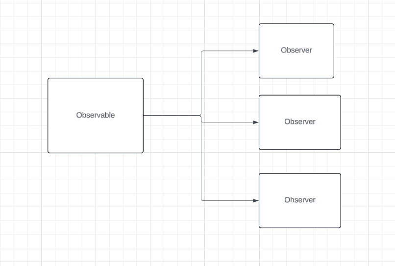
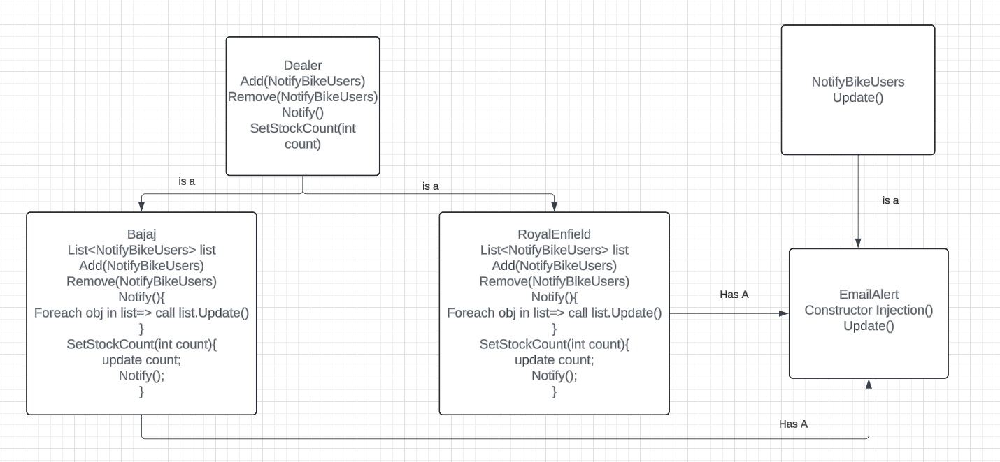

When is Observer Design Pattern used?

When we want to notify about a change in data to all the subscribed users.
There are entities Observable and Observers. Observable is responsble to handle the data and notify the subscribed users.
Observers are the subscribed users.

Below is an example which shows that whenever a royal enfield bike is in stock how it will update the users.
